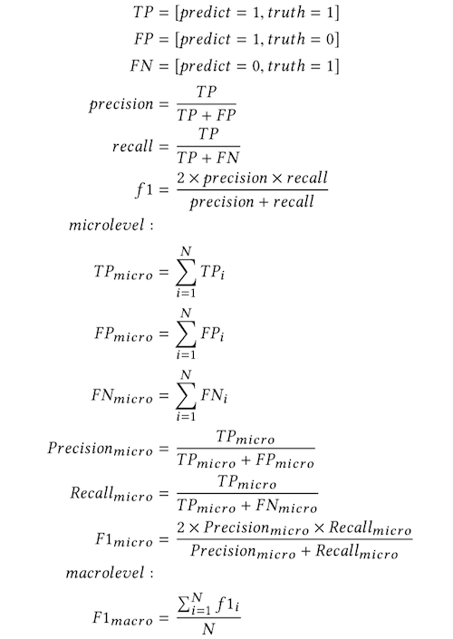

#     Chinese AI and Law Challenge Competition

## Content

* [Introduction](Introduction)
* [Task Specification](Task Specification)

## 1. Introduction

Intelligent Legal aims at giving machines the ability to judge a case by predicting charges, relevant articles and the term of penalty. This application can help lawyers to judge more sufficiently. In recent years, the improvement of deep learning and natural language processing begins to help the field of law. The combination of AI and law has been noticed by many people.

In order to promote the development of the related technology of legal intelligence, under the guidance of xxx, yyy, together with zzz jointly sponsored 2018 Chinese AI and Law Challenge Competition([CAIL2018](http://cail.cipsc.org.cn/)). The competition aims to provide researchers with a platform for academic exchange, promote language understanding and the application of artificial intelligence technology in the legal field, and promote the development of Legal Artificial intelligence. Technical exchanges and awards will be held after the end of each year. Researchers and developers from academia and industry are invited to take part in this challenge.


## 2. Task Specification

### 2.1 Introduction

* Task 1(Charge Prediction): Predicting the charges according to the fact description in the law documents;
* Task 2(Relevant Articles Prediction): Predicting the relevant articles according to the fact description in the law documents;
* Task 3(Term of Penalty Prediction)：Predicting the term of penalty according to the fact description in the law documents.

The contestants can one or more tasks to take part in the competition. Meanwhile, we will provide rewards for every task in order to encourage contestants to take part in more tasks.

### 2.2 Data

The data of the competition comes from the law documents of criminal cases published on  [Chinese Judgment Online](http://wenshu.court.gov.cn/). Every document contains the fact description and the details of the cases. Relevant articles, the charges of the defendants, and the term of penalty are also included in every case.

The dataset contains 2,680,000 criminal law documents，covered [202 charges](meta/accu.txt)，[183 articles](meta/law.txt)，and the term of penalty varies from **0 to 25 years, including the life imprisonment and the death penalty**.

There are two parts of our dataset called CAIL2018-Small and CAIL2018-Large. CAIL2018-Small contains about 196,000 documents in total, including about 150,000 documents for training, 16,000 documents for validating and 30,000 documents for testing. CAIL2018-Large contains 1,500,000 documents for training, and another 900,000 documents for testing.

#### 2.2.1 The Fields of Data
The data are stored in JSON format and every line in the data contains one document. The details of the fields in the data are listed following:

* **fact**: The description of fact.
* **meta**: The label information which contains:
    * **criminals**: The defendant in the cases. (There will only be one defendant in the case.)
    * **punish\_of\_money**: The punishing of money in unit RMB.
    * **accusation**: The defendant's charges.
    * **relevant\_articles**: The relevant articles to the case.
    * **term\_of\_imprisonment**: The term of imprisonment of the defendant.
        There three more fields in this part:
        * **death\_penalty**: Whether the defendant suffers the death penalty.
        * **life\_imprisonment**: Whether the defendant suffers the life imprisonment.
        * **imprisonment**: The length of the term of imprisonment in terms of months.

Here is an example of the data:

```json
{   
    "fact": "2015年11月5日上午，被告人胡某在平湖市乍浦镇的嘉兴市多凌金牛制衣有限公司车间内，与被害人孙某因工作琐事发生口角，后被告人胡某用木制坐垫打伤被害人孙某左腹部。经平湖公安司法鉴定中心鉴定：孙某的左腹部损伤已达重伤二级。",   
    "meta": 
    {  
        "relevant_articles": [234],  
        "accusation": ["故意伤害"], 
        "criminals": ["胡某"],  
        "term_of_imprisonment": 
        {  
            "death_penalty": false,  
            "imprisonment": 12,  
            "life_imprisonment": false
        }
    }
}
```

### 2.3 Dataset Download

**CAIL2018 Dataset** can be download from [here](https://cail.oss-cn-qingdao.aliyuncs.com/CAIL2018_ALL_DATA.zip).

##### Reference

If you use CAIL2018 dataset to publish papers or academic achievements, you should declare that you use CAIL2018 dataset and cite as follows:

- Chaojun Xiao, Haoxi Zhong, Zhipeng Guo, Cunchao Tu, Zhiyuan Liu, Maosong Sun, Yansong Feng, Xianpei Han, Zhen Hu, Heng Wang, Jianfeng Xu. CAIL2018: A Large-Scale Legal Dataset for Judgment Prediction. arXiv preprint arXiv:1807.02478, 2018.

### 2.4 Evaluation Methods

We have provided the scoring program for contestants, and you can find the details of the evaluation methods, environment and model submission at [here](https://github.com/thunlp/CAIL2018).

The full score of every task is 100, and here are the details of evaluation methods.

#### 2.4.1 Task 1, 2

Task 1(Charge Prediction) and task 2(Relevant Articles Prediction) use Micro-F1-measure and Macro-F1-measure as the evaluation method. The calculation should follow:



And the final score should be:


#### 2.4.2 Task 3

For task 3(The Term of Penalty Prediction), suppose the prediction result is `lp` and the standard answer is `la`, then let


```
If v≤0.2，then score=1；
If 0.2<v≤0.4，then score=0.8
...
And so on.
```
**Special case**

If the standard answer is the death penalty or the life imprisonment, the prediction `lp` should equal to `-2` or `-1` otherwise there is no score. The details can be found from [here](https://github.com/thunlp/CAIL2018/blob/a258c1dae88e8fc576529e6dcb012a430da00b95/judger/judger.py#L90).

Finally, the score of task 3 should be:


#### 2.4.3 Total score

The total score should be:


### 2.5 Baseline

We have provided a baseline system for all the three tasks([LibSVM](https://github.com/thunlp/CAIL2018/tree/master/baseline)).

## FAQ

### 0. Is there a platform for contestants to communicate with others？

QQ group number: 237633234.

### 1. Where can we download the dataset?

[Here](https://cail.oss-cn-qingdao.aliyuncs.com/CAIL2018_ALL_DATA.zip).